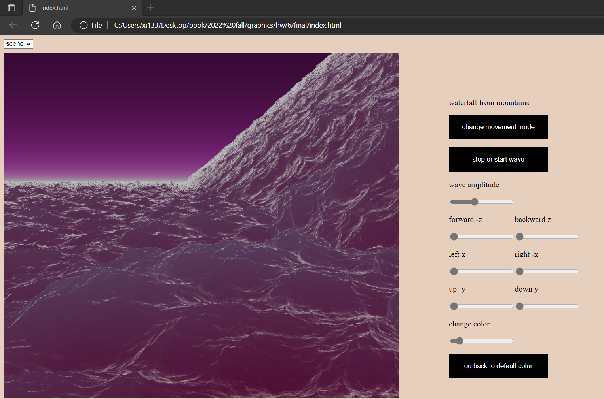
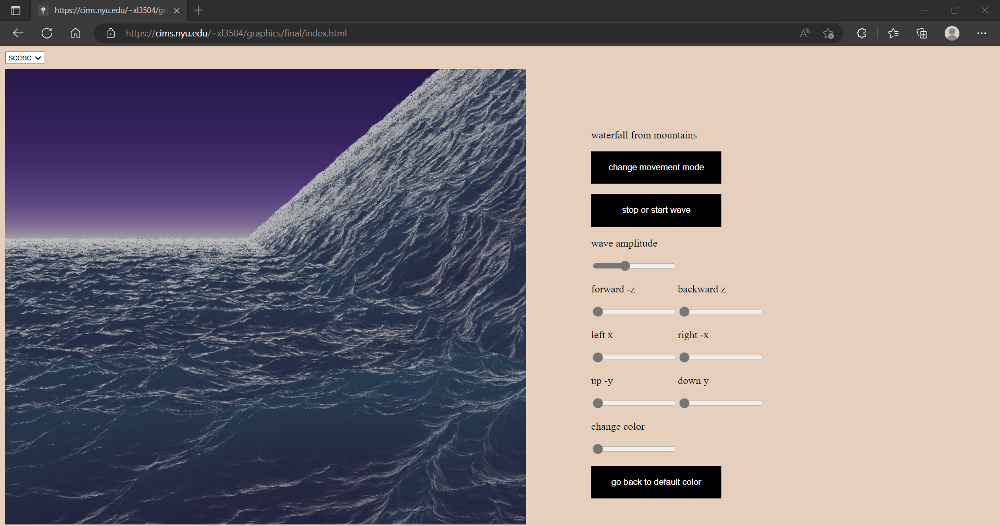
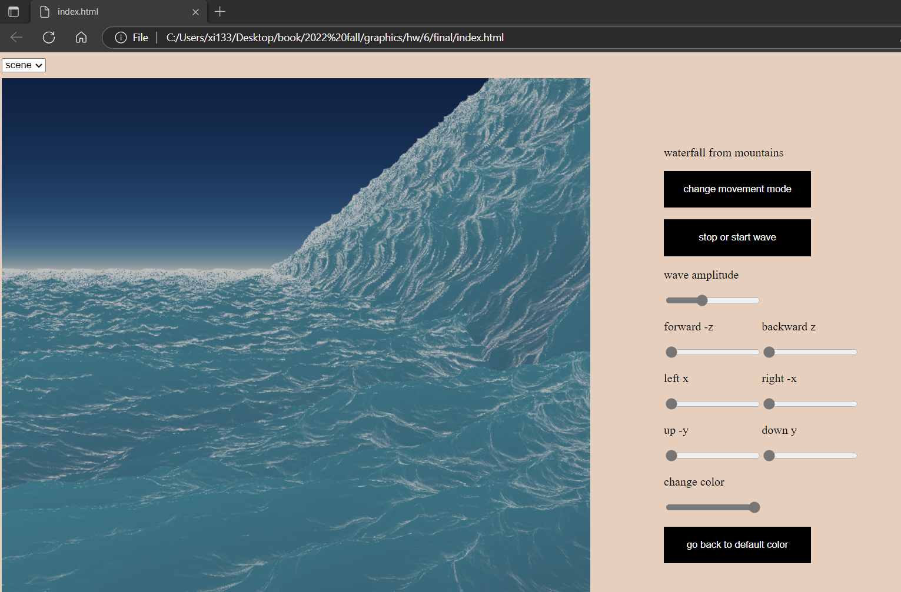
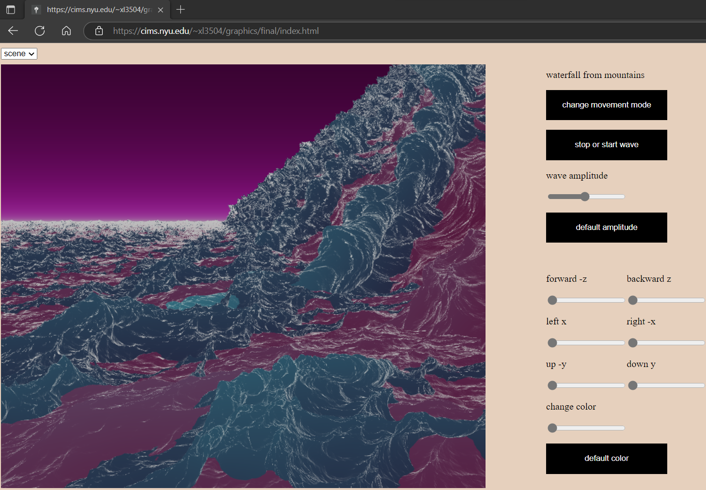
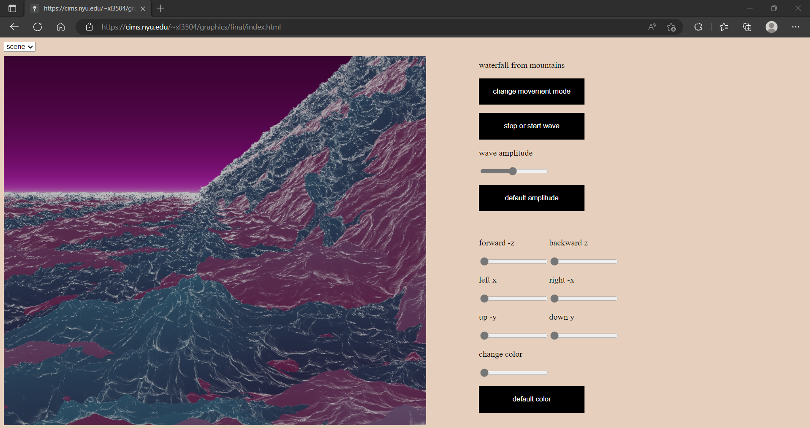
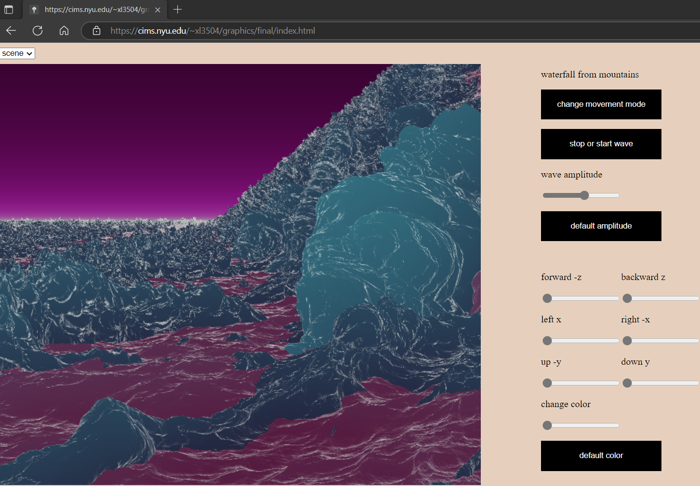
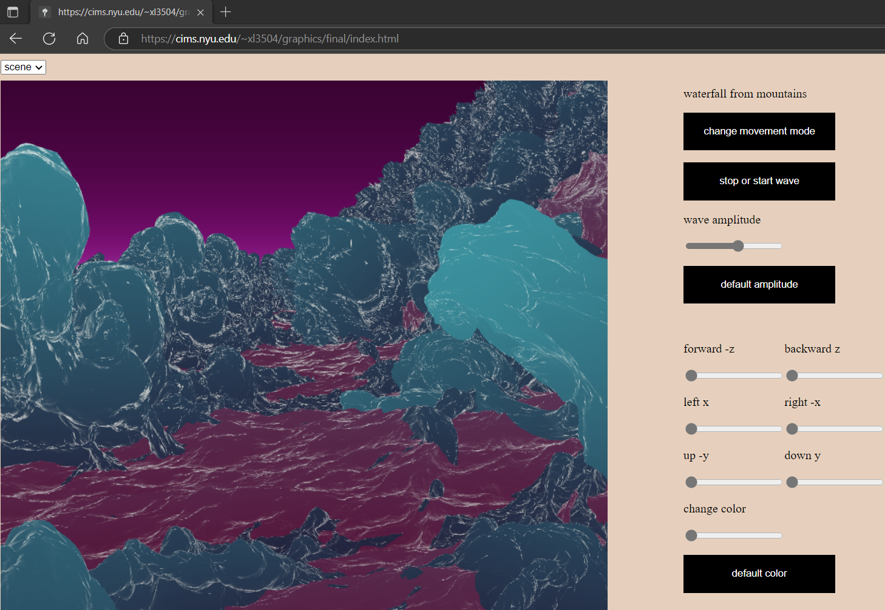

# waterfall from mountains

Xi Liu<br>
This project is done for computer graphics course at New York University, fall 2022, using WebGL.<br>
Waterfall simulation using a statistical model of random wave height field and fast fourier transformation. In which the amplitude is computed through gaussian random numbers. A texture is used for displacement mapping, in which the ```x, y, z``` displacements calculated from inverse fft are combined into one texture in ```tex()``` in ```lib.js``` using a ```format``` of ```gl.RGBA32F``` in ```gl.texImage2D```. For each successive of four components, they are grouped into one element, assigning the $x, y, z$ displacements $x[i][j], y[i][j], z[i][j]$ to the red, green, blue channels $a[a\\_i], a[a\\_i + 1], a[a\\_i + 2]$ respectively, and assigning a value of one to the alpha channel. First, in the vertex shader, use the ```texture2D()``` to lookup the texture and obtain the vec3 displacement and add it to the vertex position ```v_pos```. Then, in the fragment shader, use the ```texture2D()``` again to sample the texture to obtain the vec3 displacement, then compute the surface normal for each varying texture coordinate from the ```s_height_map``` sampler inside the ```normal_map()``` function using the finite difference method.

## method
The task is to find height $h$ given horizontal position $x, z$, and $t$.<br>
Decompose the wave height field as a sum of sin and cos waves using fft.<br>
Let $\mathscr{S}(\mathbb{R} ^ n, \mathbb{C}) = \\{f \in \mathbb{C} ^ {\infty}(\mathbb{R} ^ n, \mathbb{C}) | \forall \alpha, \beta \in \mathbb{N} ^ n, \sup_{x \in \mathbb{R} ^ n} |x ^ {\alpha} \delta ^ {\beta} f(x)| < \infty\\}$ be a schwartz space, $f \in \mathscr{S}(\mathbb{R} ^ n)$ be a signal. Define $\widetilde f$ as the fourier transform of $f$
```math
\displaylines
{
  \widetilde{f}(k) = \int_{\mathbb{R} ^ n} f(x) e ^ {-2 \pi i k x} dx\\
  \text{for discrete signal $f$ with $N$ samples}\\
  \widetilde{f}[k] = \sum_{n = 0} ^ {N - 1} f[n] e ^ {\frac{-2 \pi i k n}{N}}\\
  \text{computing $\widetilde{f}$ of $f$ with $N$ samples naively require $N$ complex multiplications}\\
  \text{and $N - 1$ complex additions for each element of $\widetilde{f}$, so its total time complexity is $\mathcal{O}(n ^ 2)$}\\
  \text{with fft, the time complexity is reduced to $\mathcal{O}(n \log n)$}\\
  \text{let } h(t) \text{ be an arbitrary, aperiodic function}\\
  \text{wave height } h(\text{x}, t), \text{horizontal position } \text{x} = (x, z)\\
  h(\text{x}, t) = \sum_{\text{k}} \widetilde{h} (\text{k}, t) e ^ {i\text{k} \cdot \text{x}}\\
}
```

expresses wave height at horizontal position $(x, z)$ as sum of sinusoids
with complex time dependent amplitudes

```math
\displaylines
{
  \mathbf{x} = (x, z)\\
  h(\mathbf{x}, t) = \sum \widetilde{h} (\mathbf{k}, t) e ^ {i\mathbf{k} \cdot \mathbf{x}}\\
}
```

$\mathbf{k}$ is a 2d vector with components
for a wave with horizontal dimensions $L_x \times L_z$
```math
\displaylines
{
  k = (k_x, k_z)\\
  k_x = 2 \pi n / L_x\\
  k_z = 2 \pi n / L_z\\
  -N / 2 \leq n < N / 2\\
  -M / 2 \leq m < M / 2\\
}
```

generates height field at discrete points $x = (n L_x / N, m L_z / M)$

float value
wave spectrum $p_h(k)$
```math
p_h(k) = \frac{a(e ^ {-1 / (kl) ^ 2})}{k ^ 4} |k \cdot w| ^ 2
```
$w$ = wind direction
$L = V ^ 2 / g$ = max wave from wind of speed V

where $L = V ^ 2 / g$ is the largest possible waves arising
from a continuous wind of speed $V$,
$g$ is the gravitational constant, and $w$ is the direction of the wind

$\widetilde{h}(k) = \frac{1}{\sqrt{2}} (\xi_r + i \xi_i) \sqrt{p_h(k)}$
where $\xi_r$ and $\xi_i$ are ordinary independent draws from a gaussian
random number generator, with mean 0 and standard deviation 1. gaussian distributed random numbers tend to follow the experimental data on ocean waves

in the fft representation, the 2d displacement vector field is computed using the fourier amplitudes
of the height field, as
$D(X, t) = \sum -i \frac{K}{k} \widetilde{h}(K, t) e ^ {ikx}$

```javascript
wave()
{
    let this_ptr = this;
    function callback()
    {
        this_ptr.interval += 0.2;
        let s = this_ptr.spectrum1.ocean(this_ptr.interval, this_ptr.htilde0, this_ptr.htilde1),
        x = this_ptr.fft.ifft(s.x),
        y = this_ptr.fft.ifft(s.y),
        z = this_ptr.fft.ifft(s.z);
        this_ptr.tex1.tex(x, y, z);
        this_ptr.draw_mesh();
    }
    window.requestAnimationFrame(callback);
}
```

for the fft computation, the cooley tukey fft algorithm is used.
the result of 2d ifft is a wave height field, then the glsl functions texture2d is used to lookup from within that texture.

at the right side of the webpage, click and release the sliders to see the change<br>
do not try to see this project on a mobile device, since a lot of the mobile
devices do not support opengl extensions for floating point textures
```javascript
gl.getExtension("EXT_color_buffer_float"); /* enable gl.RGBA32F to be color renderable */
gl.getExtension("OES_texture_float_linear"); /* linear filtering with float pixel textures */
```

## future work
To lower the branch divergence on the gpu caused by conditional statements, several shaders are used now and using ```getElementById()``` to switch different shaders for different objects. For better file organization, the shaders should be written in separate files and loaded through ```XMLHttpRequest()```. In the future, the fft and philips spectrum calculations can be done in gpu compute shaders instead of cpu. currently code is in cpu, cpu have the advantage of more flexible in the coding part where classes can be easily called by other classes, but gpgpus can be faster in terms of floating point operations per second. Webassembly also can be used to lower the overhead.







