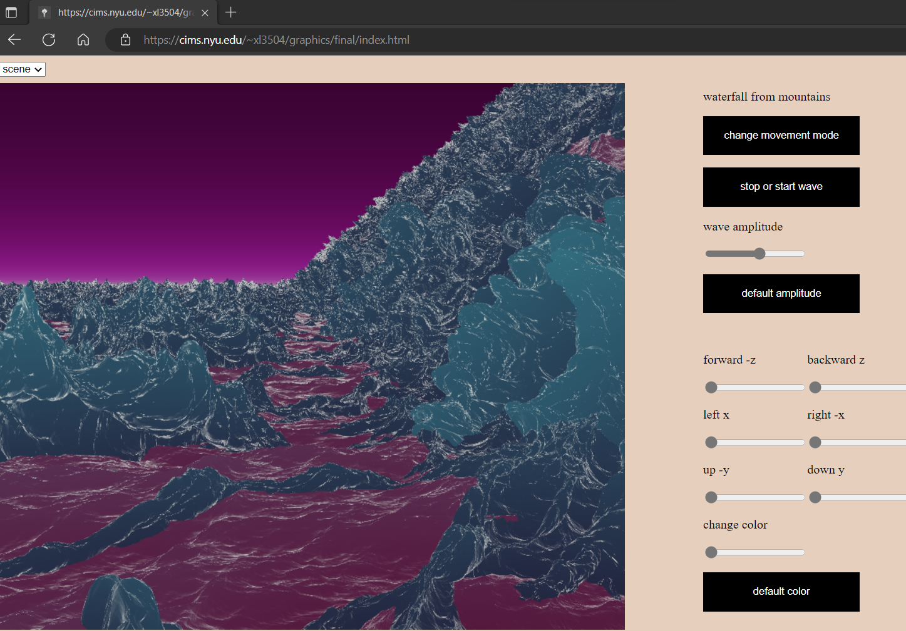

# waterfall from mountains

Xi Liu<br>
This project is done for computer graphics course at New York University, fall 2022, using WebGL.<br>
Waterfall simulation using a statistical model of random wave height field and fast fourier transformation. The amplitude is computed through gaussian random numbers and the philips spectrum. The wave distribution is computed in the frequency domain, then uses inverse fft to obtain the wave height function in the time domain. A texture is used for displacement mapping, in which the ```x, y, z``` displacements calculated from inverse fft are combined into one texture in ```tex()``` in ```lib.js``` using a ```format``` of ```gl.RGBA32F``` in ```gl.texImage2D()```. For each successive of four components, they are grouped into one element, assigning the $x, y, z$ displacements $x[i][j], y[i][j], z[i][j]$ to the red, green, blue channels $a[a\\_i], a[a\\_i + 1], a[a\\_i + 2]$ respectively, and assigning a value of one to the alpha channel. In the vertex shader, use the ```texture2D()``` to lookup the texture and obtain the vec3 displacement and add it to the vertex position ```v_pos```. In the fragment shader, use the ```texture2D()``` again to sample the texture to obtain the vec3 displacement, then compute the surface normal for each varying texture coordinate from the ```s_height_map``` sampler inside the ```normal_map()``` function using the finite difference method.

## method
The task is to find height $h$ given horizontal position $x, z$, and time $t$.<br>
Decompose the wave height field as a sum of sin and cos waves using fft.<br>
Let $\mathscr{S}(\mathbb{R} ^ n, \mathbb{C}) = \\{f \in \mathbb{C} ^ {\infty}(\mathbb{R} ^ n, \mathbb{C}) | \forall \alpha, \beta \in \mathbb{N} ^ n, \sup_{x \in \mathbb{R} ^ n} |x ^ {\alpha} \delta ^ {\beta} f(x)| < \infty\\}$ be a schwartz space, $f \in \mathscr{S}(\mathbb{R} ^ n)$ be a signal. Define $\widetilde f$ as the fourier transform of $f$
```math
\displaylines
{
  \widetilde{f}(k) = \int_{\mathbb{R} ^ n} f(x) e ^ {-2 \pi i k x} dx\\
  \text{for discrete signal $f$ with $N$ samples}\\
  \widetilde{f}(k) = \sum_{n = 0} ^ {N - 1} f(n) e ^ {\frac{-2 \pi i k n}{N}}\\
  \text{computing $\widetilde{f}$ of $f$ with $N$ samples naively require $N$ complex multiplications}\\
  \text{and $N - 1$ complex additions for each element of $\widetilde{f}$, so its total time complexity is $\mathcal{O}(n ^ 2)$}\\
  \text{with fft, the time complexity is reduced to $\mathcal{O}(n \log n)$}\\
  \text{expresses wave height at horizontal position $(x, z)$ as sum of sinusoids with complex amplitudes}\\
  \text{wave height } h(\text{x}, t), \text{horizontal position } \text{x} = (x, z)\\
  h(\mathbf{x}, t) = \sum_{\mathbf{k}} \widetilde{h} (\mathbf{k}, t) e ^ {i\mathbf{k} \cdot \text{x}}\\
  \widetilde{h}(\mathbf{k}, t) = \widetilde{h}_0(\mathbf{k})e ^ {i\omega(k)t} + \widetilde{h}_0 ^ *(-\mathbf{k})e ^ {-i\omega(k)t},\quad \widetilde{h} ^ *(\mathbf{k}, t) = \widetilde{h}(-\mathbf{k}, t)\\
  \omega(k) = \pm \sqrt{gk}, \quad \text{dispersion relation, $g$ is gravity constant, $k$ is wavevector, $\omega$ is frequency}\\
  \mathbf{k} = (k_x, k_z) = \left(\frac{2 \pi n}{L_x}, \frac{2 \pi m}{L_z}\right), \quad L_x \times L_z \text{ is the horizontal dimensions of the wave}\\
  n, m \in \mathbb{Z}, n \in \left[-\frac{N}{2}, \frac{N}{2}\right), m \in \left[-\frac{M}{2}, \frac{M}{2}\right)\\
  \text{The height field is generated at discrete points } x = \left(\frac{n L_x}{N}, \frac{m L_z}{M}\right)\\
  \text{wave spectrum }p_h(k) = \frac{a(e ^ {-1 / (kl) ^ 2})}{k ^ 4} |k \cdot w| ^ 2,\quad \text{$w$ = wind direction.
$L = V ^ 2 / g$ = max wave from wind of speed V}\\
  \widetilde{h}(k) = \frac{1}{\sqrt{2}} (\xi_r + i \xi_i) \sqrt{p_h(k)}, \quad \text{$\xi_r$ and $\xi_i$ are independently generated from a gaussian
random number generator}\\
  \mathbf{d}(\mathbf{x}, t) = \sum_{\mathbf{k}} -i \frac{\mathbf{k}}{k} \widetilde{h}(\mathbf{k}, t) e ^ {i\mathbf{k} \cdot x}, \quad \text{the 2d displacement vector field is computed using the fourier amplitudes of the height field}\\
}
```

```javascript
wave()
{
    let this_ptr = this;
    function callback()
    {
        this_ptr.interval += 0.2;
        let s = this_ptr.spectrum1.ocean(this_ptr.interval, this_ptr.htilde0, this_ptr.htilde1),
        x = this_ptr.fft.ifft(s.x),
        y = this_ptr.fft.ifft(s.y),
        z = this_ptr.fft.ifft(s.z);
        this_ptr.tex1.tex(x, y, z);
        this_ptr.draw_mesh();
    }
    window.requestAnimationFrame(callback);
}
```

For the fft computation, the cooley tukey fft algorithm is used.
The result of 2d ifft is a displacement map, then the glsl function ```texture2d()``` is used to lookup from within that texture. Vertex positions, surface normals, and various data are computed from the displacement map.

At the right side of the webpage, click and release the sliders to see the change.<br>
You should see this project on a device that support extensions for floating point textures.
```javascript
gl.getExtension("EXT_color_buffer_float"); /* enable gl.RGBA32F to be color renderable */
gl.getExtension("OES_texture_float_linear"); /* linear filtering with float pixel textures */
```

## future work
To lower the branch divergence on the gpu caused by conditional statements, several shaders are used now and using ```getElementById()``` to switch different shaders for different objects. For better file organization, the shaders should be written in separate files and loaded through ```XMLHttpRequest()```. In the future, the fft and philips spectrum calculations can be done in gpu compute shaders instead of cpu. As the size of the displacement texture increases, the time needed to transfer data between cpu and gpu increases. The massively parallel architecture of gpgpus can be faster for the fft and phillips spectrum calculation. Webassembly also can be used to lower the overhead.





